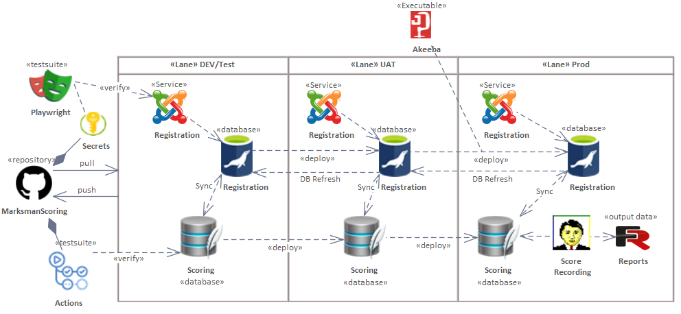

# GitHubProject161

## System Overview

The following diagram shows the end‑to‑end workflow across DEV/Test, UAT, and PROD, including
GitHub Actions, Playwright verification, database synchronization, and deployment pipelines.

